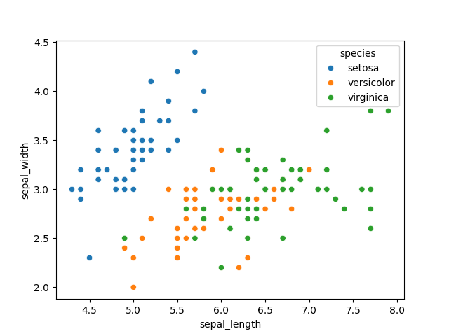
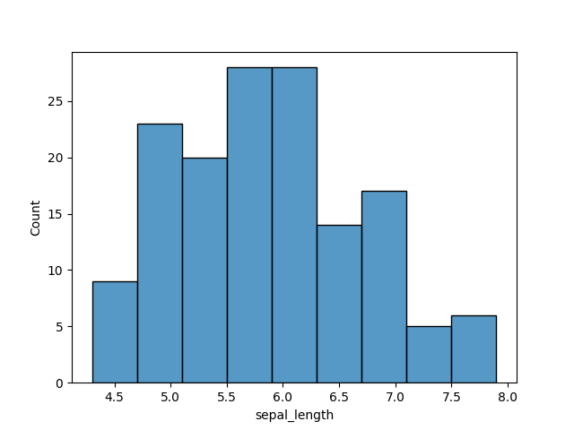
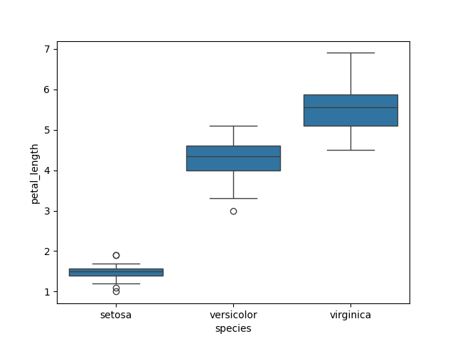

## ▶️ View Notebook Online
You can open the notebook here:
https://nbviewer.org/

# 🌸 Iris Dataset Analysis

## 📌 Objective

To explore and visualize the Iris dataset using Python libraries.

---

## 🛠️ Tools Used

* Python
* pandas
* matplotlib
* seaborn

---

## 📊 Dataset Overview

The dataset contains measurements of iris flowers:

* Sepal Length
* Sepal Width
* Petal Length
* Petal Width
* Species

---

## 🔍 Tasks Performed

* Loaded dataset using pandas
* Inspected structure (`shape`, `columns`, `head`)
* Generated visualizations:

  * Scatter Plot
  * Histogram
  * Box Plot

---

## 📈 Visualizations

### 🔹 Scatter Plot

Shows relationship between sepal length and width.

---

### 🔹 Histogram

Shows distribution of sepal length.

---

### 🔹 Box Plot

Shows spread and outliers in petal length.

---

## 🚀 How to Run

1. Open the notebook file
2. Run all cells
3. View outputs

---

## 📎 Repository Contents

* `iris_analysis.ipynb` → main notebook
* `images/` → visualization screenshots

---
